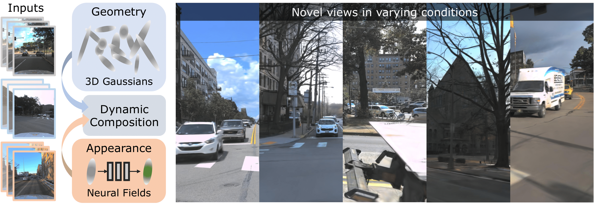

<div align="center">

##  Dynamic 3D Gaussian Fields for Urban Areas

<a href="https://tobiasfshr.github.io/">Tobias Fischer</a><sup>1</sup>, <a href="https://jkulhanek.com/">Jonas Kulhanek</a><sup>1,3</sup>, <a href="https://scholar.google.com/citations?user=484sccEAAAAJ&hl=en">Samuel Rota Bulo</a><sup>2</sup>, <a href="https://scholar.google.it/citations?user=vW1gaVEAAAAJ&hl=it">Lorenzo Porzi</a><sup>2</sup>, <a href="https://people.inf.ethz.ch/marc.pollefeys/">Marc Pollefeys</a><sup>1</sup>, <a href="https://scholar.google.com/citations?user=CxbDDRMAAAAJ&hl=en">Peter Kontschieder</a><sup>2</sup>

<sup>1</sup>ETH Zurich <sup>2</sup>Meta Reality Labs <sup>3</sup>CTU Prague
</div>



### [Project Page](https://tobiasfshr.github.io/pub/4dgf) | [Paper](https://arxiv.org/pdf/2406.03175) | [ArXiv](http://arxiv.org/abs/2406.03175)


Before running the model, please follow the instructions in [README.md](../../README.md) to download and preprocess the data.

## Training

To reproduce the experiments in the paper, use the following commands

### Argoverse2
```
ns-train 4dgf-av2-big --machine.num-devices 8 --pipeline.model.max-num-gaussians 8000000 --pipeline.model.object-grid-log2-hashmap-size 17 street --data data/Argoverse2/metadata_PIT_6180_1620_6310_1780.pkl --voxel-size 0.15
ns-train 4dgf-av2-big --machine.num-devices 8 --pipeline.model.max-num-gaussians 8000000 --pipeline.model.object-grid-log2-hashmap-size 17 street --data data/Argoverse2/metadata_PIT_1100_-50_1220_150.pkl --voxel-size 0.15
```

### Waymo
```
ns-train 4dgf-waymo --data data/waymo/metadata_<sequence_name>.pkl
```

### VKITTI2
```
ns-train 4dgf-vkitti street --data data/VKITTI2/metadata_02.pkl --train-split-fraction [0.75|0.5|0.25]
ns-train 4dgf-vkitti street --data data/VKITTI2/metadata_06.pkl --train-split-fraction [0.75|0.5|0.25]
ns-train 4dgf-vkitti street --data data/VKITTI2/metadata_18.pkl --train-split-fraction [0.75|0.5|0.25]
```

### KITTI
```
ns-train 4dgf-kitti street --data data/KITTI/tracking/training/metadata_0001.pkl --train-split-fraction [0.75|0.5|0.25]
ns-train 4dgf-kitti street --data data/KITTI/tracking/training/metadata_0002.pkl --train-split-fraction [0.75|0.5|0.25]
ns-train 4dgf-kitti street --data data/KITTI/tracking/training/metadata_0006.pkl --train-split-fraction [0.75|0.5|0.25]
```

## Citation

```
@article{fischer2024dynamic,
  title={Dynamic 3D Gaussian Fields for Urban Areas},
  author={Fischer, Tobias and Kulhanek, Jonas and Bul{\`o}, Samuel Rota and Porzi, Lorenzo and Pollefeys, Marc and Kontschieder, Peter},
  journal={arXiv preprint arXiv:2406.03175},
  year={2024}
}
```
