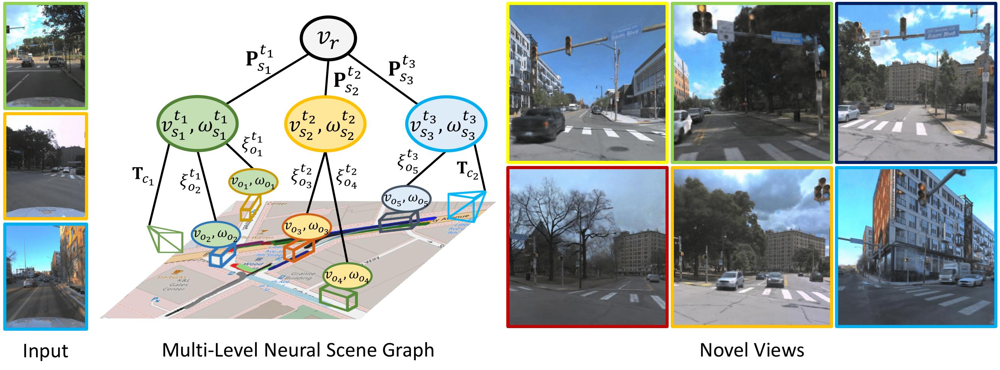

<div align="center">

##  Multi-Level Neural Scene Graphs for Dynamic Urban Environments

<a href="https://tobiasfshr.github.io/">Tobias Fischer</a><sup>1</sup>, <a href="https://scholar.google.it/citations?user=vW1gaVEAAAAJ&hl=it">Lorenzo Porzi</a><sup>2</sup>, <a href="https://scholar.google.com/citations?user=484sccEAAAAJ&hl=en">Samuel Rota Bulo</a><sup>2</sup>, <a href="https://people.inf.ethz.ch/marc.pollefeys/">Marc Pollefeys</a><sup>1</sup>, <a href="https://scholar.google.com/citations?user=CxbDDRMAAAAJ&hl=en">Peter Kontschieder</a><sup>2</sup>

<sup>1</sup>ETH Zurich <sup>2</sup>Meta Reality Labs

### *CVPR 2024*
</div>



### [Project Page](https://tobiasfshr.github.io/pub/ml-nsg) | [Paper](https://arxiv.org/pdf/2404.00168) | [ArXiv](https://arxiv.org/abs/2404.00168)


Before running the model, please follow the instructions in [README.md](../../README.md) to download and preprocess the data.

## Training

To reproduce the experiments in the paper, use the following commands

### VKITTI2
```
ns-train ml-nsg-vkitti2 --vis wandb street --data data/VKITTI2/metadata_02.pkl --train-split-fraction [0.75|0.5|0.25]
ns-train ml-nsg-vkitti2 --vis wandb street --data data/VKITTI2/metadata_06.pkl --train-split-fraction [0.75|0.5|0.25]
ns-train ml-nsg-vkitti2 --vis wandb street --data data/VKITTI2/metadata_18.pkl --train-split-fraction [0.75|0.5|0.25]
```

### KITTI

```
ns-train ml-nsg-kitti --vis wandb street --data data/KITTI/tracking/training/metadata_0001.pkl --train-split-fraction [0.75|0.5|0.25]
ns-train ml-nsg-kitti --vis wandb street --data data/KITTI/tracking/training/metadata_0002.pkl --train-split-fraction [0.75|0.5|0.25]
ns-train ml-nsg-kitti --vis wandb street --data data/KITTI/tracking/training/metadata_0006.pkl --train-split-fraction [0.75|0.5|0.25]
```
You can additionally reproduce the image reconstruction experiments by setting the train split fraction to 1.0
```
# NOTE: re-compute the metadata for image reconstruction for sequence 0006
mp-process kitti --vis wandb --sequence 0006 --task imrec

# Run the training
ns-train ml-nsg-kitti --vis wandb --vis wandb street --train-split-fraction 1.0 --data ...
```

### Argoverse2
```
ns-train ml-nsg-av2 --vis wandb --data data/Argoverse2/metadata_PIT_6180_1620_6310_1780.pkl
ns-train ml-nsg-av2 --vis wandb --data data/Argoverse2/metadata_PIT_1100_-50_1220_150.pkl
```

## Citation
```
@InProceedings{fischer2024multi,
    author    = {Fischer, Tobias and Porzi, Lorenzo and Rota Bul\`{o}, Samuel and Pollefeys, Marc and Kontschieder, Peter},
    title     = {Multi-Level Neural Scene Graphs for Dynamic Urban Environments},
    booktitle = {Proceedings of the IEEE/CVF Conference on Computer Vision and Pattern Recognition},
    year      = {2024}
}
```
